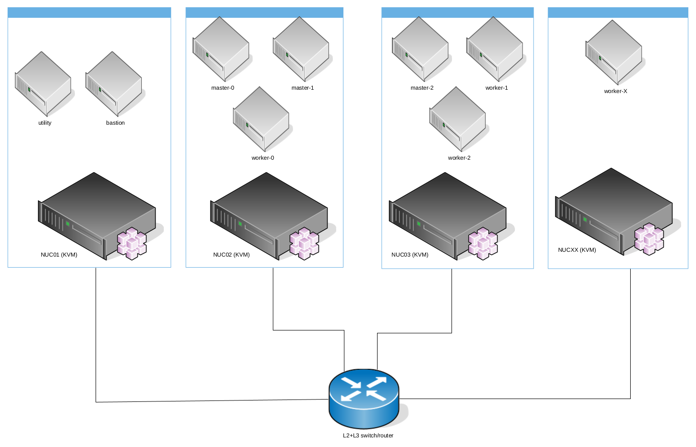
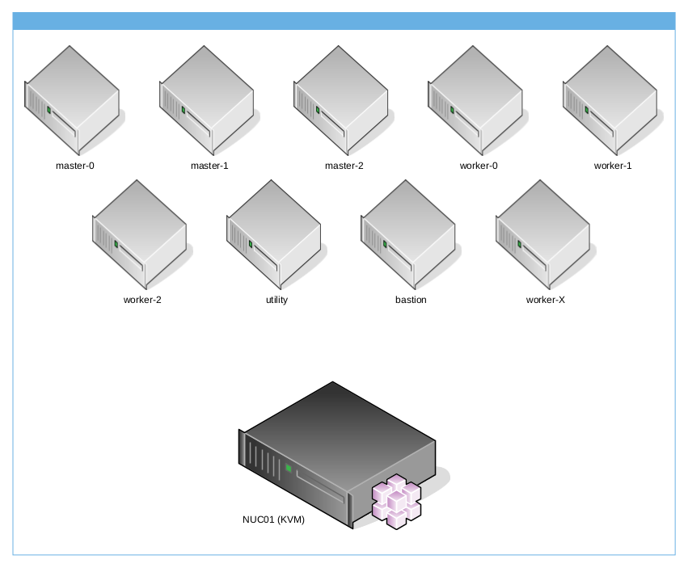

ocp4-in-the-jars
=====================
Introduction
------------
I use those Ansible playbooks to install **OpenShift Container Platform 4.x** on a couple of (similar) Intel NUC, to test [Installer-provisioned (IPI) clusters on bare metal](https://docs.openshift.com/container-platform/4.11/installing/installing_bare_metal_ipi/ipi-install-overview.html); where instead of using bare metal nodes I use virtual machines on NUC hosts.

The advantages of using this approach, is spanning resource requirements to multiple, little and usually cheaper hosts, instead of using only one, bigger host; but the playbook is flexible to be used also against one, bigger host.

All OpenShift hosts will be created as a virtual machine with nested virtualization upon your NUCs.

**Warning:** This project / repository / playbooks should be used **only for testing** OpenShift Container Platform 4.x and **NOT** for production environment.

Architecture using multiple hosts
---------------------

In the following example, multiple hosts are used and could be added in the future, for example to add more worker nodes.



Architecture using only one host
---------------------

In the following example, only one host is used, for example, you can rent a dedicated server on Hetzner, with CentOS Stream 8, and running against it the playbook `prepare-hypervisor.yaml` you will have a single KVM hypervisor, reachable on the internet, with iptables rules to route `api` and `apps` to OpenShift and NAT rules to allow master and worker nodes to reach "Internet"



Requirements
------------
### Operating System and packages
Your Linux NUC hosts require the following **packages** installed and working:

- libvirt
- qemu
- nested virtualization
- libguestfs
- virtualbmc or sushy-tools
- ssh

there is no constraint on which Linux distribution to use, for example, I use Gentoo, but you can use RHEL 8, CentOS Stream 8, Ubuntu, Arch... for example to set up a similar project on a Cloud dedicated CentOS Stream 8 server I used this Ansible playbook:

[prepare-hypervisor.yaml](prepare-hypervisor.yaml)

if you use Gentoo, like me, you can simply install the required packages from the Portage and virtualbmc or sushy-tools, from my overlay "amedeos"

### Layer2 and Layer3
In my homelab I used a layer2+layer3 switch from Netgear, its very simple and cheaper managed switch (I paid for Netgear GS108TV3 ~70 bucks), but remember, if you want to use more than one NUC, you will need to connect all your hosts to one switch in order to use the required networks.

#### Only baremetal network
The Ansible Playbooks, by default, will use only one Linux bridge for OpenShift, which is **bm** for baremetal network (could be native VLAN or tagged by your hypervisor). If you want to use only baremetal network, you have to setup **sushy-tools** on each NUC host in order to simulate redfish emulator.

Example configuration for your L2+L3 switch with baremetal network:

| VLAN | Name | Subnet | Native | Bridge | Gateway |
| ---- | ---- | ------ | ------ | ------ | ------- |
| 2003 | Baremetal | 192.168.203.0/24 | | bm | 192.168.203.1 |

#### Provisioning and baremetal networks
In this case, you'll use both provisioning and baremetal networks using two Linux bridges for OpenShift, which is **prov** for provisioning network (must be native VLAN), and **bm** for baremetal network, this could be a VLAN (in my case VLAN 2003), but you can adapt to your needs. If you want to use both provisioning and baremetal networks, you have to set up **virtualbmc** on each NUC host in order to use ipmi emulator.

For example, if you have, like me, only one network adapter, and you want to create two bridges, prov and bm, where prov has the primary IP in a native VLAN and bm is connected to the same link (in my case eno1) but with the VLAN 2003 you have to:

- configure your L2+L3 switch with both VLANs, where the provisioning VLAN is native:

| VLAN | Name | Subnet | Native | Bridge | Gateway |
| ---- | ---- | ------ | ------ | ------ | ------- |
| 2001 | Provisioning | 192.168.201.0/24 | True | prov | 192.168.201.1 |
| 2003 | Baremetal | 192.168.203.0/24 | | bm | 192.168.203.1 |

#### Example bridges configuration
Below you can find some linux bridges configuration.

- configure your Linux KVM host with **prov** bridge attached to your interface:

```bash
$ nmcli connection add ifname prov type bridge con-name prov
$ nmcli connection add type bridge-slave ifname eno1 master prov
$ nmcli connection modify prov bridge.stp no
$ nmcli connection modify prov ipv4.addresses 192.168.201.110/24
$ nmcli connection modify prov ipv4.gateway 192.168.201.1
$ nmcli connection modify prov ipv4.dns '1.1.1.1'
$ nmcli connection modify prov ipv4.dns-search 'example.com'
$ nmcli connection modify prov ipv4.method manual
$ nmcli connection down prov ; nmcli connection up prov
```

- configure your Linux KVM host with **bm** bridge using VLAN id 2003:

```bash
$ nmcli connection add ifname bm type bridge con-name bm
$ nmcli connection modify bm ipv4.method disabled ipv6.method ignore
$ nmcli connection up bm
$ nmcli connection add type vlan con-name prov.2003 ifname prov.2003 dev prov id 2003
$ nmcli connection modify prov.2003 master bm slave-type bridge
$ nmcli connection down prov.2003 ; nmcli connection up bm
```

- add to your KVM host all additional IPMI IP to prov:
```bash
$ nmcli connection modify prov +ipv4.addresses 192.168.201.111/24
$ nmcli connection modify prov +ipv4.addresses 192.168.201.112/24
$ nmcli connection modify prov +ipv4.addresses 192.168.201.113/24
...
```

### vCPU and vRAM
OpenShift Container Platform requires various Virtual Machines, below the list of Virtual Machines created and their flavor:

| VM | Role | vCPU | vRAM | Disks |
| :--: | :----: | :----: | :----: | :-----: |
| utility | - | 2 | 2G | 1x100G |
| bastion | provisioner | 6 | 16G | 1x100G |
| master-0 | master | 4 | 16G | 1x150G |
| master-1 | master | 4 | 16G | 1x150G |
| master-2 | master | 4 | 16G | 1x150G |
| worker-0 | worker | 8 | 32G | 1x150G + 1x400G |
| worker-1 | worker | 8 | 32G | 1x150G + 1x400G |
| worker-2 (optional) | worker | 8 | 32G | 1x150G + 1x400G |
| | | | | |
| | **Total:** | **44** | **162G** | **2.3T** |

The most critical resource is the vRAM, because all hosts, during the installation will be memory consuming; instead all disks will be created in thin provisioning and for this reason a clean deploy will take up to 10-15% provisioned space.

### Red Hat Enterprise Linux 8.6 qcow2
You need to download from Red Hat customer portal the RHEL 8.6 qcow2 file and make it available for download in the NUC that will be the KVM host for the bastion and utility host.

For example, from a running and entitled RHEL host you can run:
```bash
curl  --cacert /etc/rhsm/ca/redhat-uep.pem --cert /etc/pki/entitlement/<YOURENTITLEMENTCERT>.pem --key /etc/pki/entitlement/<YOURENTITLEMENTKEY>-key.pem https://cdn.redhat.com/content/dist/rhel8/8/x86_64/baseos/iso/rhel-8.6-x86_64-kvm.qcow2 -o rhel-8.6-x86_64-kvm.qcow2
```
**Note:** only the bastion and utility VM will be generated starting from this qcow2 file, all OpenShift nodes will be installed and configured, as usual, by the installer.

Configurations for your environment
-----------------------------------
### variables.yaml
Open **variables.yaml** and **vault-variables.yaml** files and edit all variables do you need to fit your requirements, but most importantly, you must change these variables:

| Variable | Description |
| :------- | :---------: |
| secure_password | Password used for root and kni user |
| rh_subcription_user | Your Red Hat Customer Portal username |
| rh_subcription_password | Your Red Hat Customer Portal password |
| rh_subcription_pool | Your Red Hat Subscription Pool ID for RHEL |
| image_location | RHEL 8.6 qcow2 URL/path |
| ssh_pub | Your ssh public key |
| ssh_key | Your ssh private key |
| duckdns_token | Your duckdns.org token for Dynamic DNS |
| pull-secret.txt | Your pull-secret from cloud.redhat.com |

### vm-ansible-nodes.json
This file maps all VM to your NUC hosts, if you use "localhost", then the Ansible local connection will be used, otherwise Ansible will use ssh connection.

For example, if you want to install the bastion on the NUC host **pippo01.example** configure bm-ansible-nodes.json with the following lines:

```json
    "bastion_nodes": [
        {
            "name": "bastion",
            "state": "present",
            "hypervisor_name": "pippo01.example.com",
            "hypervisor_user": "root",
            "hypervisor_ssh_key": "~/.ssh/id_rsa",
            "hypervisor_image_dir": "/var/lib/libvirt/images",
            "vbmc_pre_cmd": "",
            "vbmc_ip": "192.168.201.114",
            "vbmc_port": "623",
            "baremetal_ip": "192.168.203.50",
            "provisioning_ip": "192.168.201.50",
            "baremetal_last": "50"
        }
    ]
```

otherwise, if you want to deploy the master-2 on the NUC host **pippo02.example.com** configure bm-ansible-nodes.json with the following lines:

```json
    "master_nodes": [
...
        {
            "name": "master-2",
            "state": "present",
            "hypervisor_name": "pippo02.example.com",
            "hypervisor_user": "root",
            "hypervisor_ssh_key": "~/.ssh/id_rsa",
            "hypervisor_image_dir": "/var/lib/libvirt/images",
            "provisioning_mac": "52:54:00:00:32:02",
            "baremetal_mac": "52:54:00:00:33:02",
            "vbmc_pre_cmd": "",
            "vbmc_ip": "192.168.201.104",
            "vbmc_port": "623",
            "redfish_ip": "192.168.203.1",
            "redfish_port": "8000",
            "baremetal_ip": "192.168.203.55",
            "baremetal_last": "55"
        }
    ]
```

Install OpenShift Container Platform
--------------------------------
Run the main.yaml playbook passing to it the Ansible vault file:

```bash
# ansible-playbook --vault-password-file <YOURVAULTPWFILE> main.yaml
```
